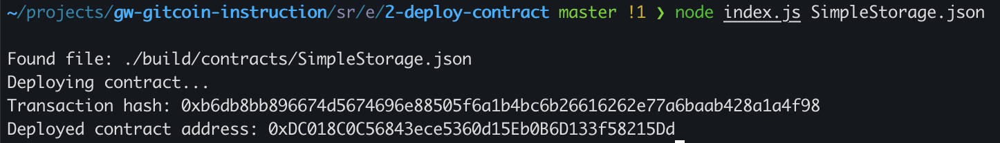

## 1. A screenshot of the console output immediately after you have successfully deployed a smart contract.

## 2. The transaction hash from the contract deployment (in text format).
0xb6db8bb896674d5674696e88505f6a1b4bc6b26616262e77a6baab428a1a4f98
## 3. The deployed contract address from the contract deployment (in text format).
0xDC018C0C56843ece5360d15Eb0B6D133f58215Dd