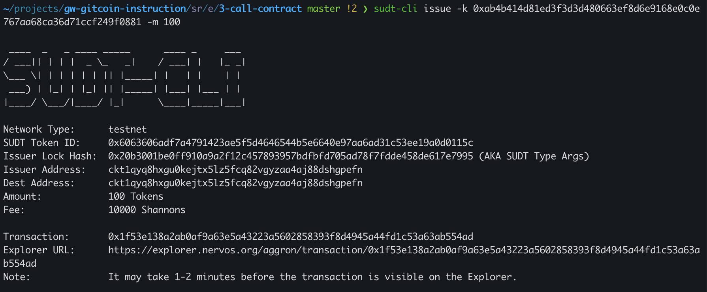
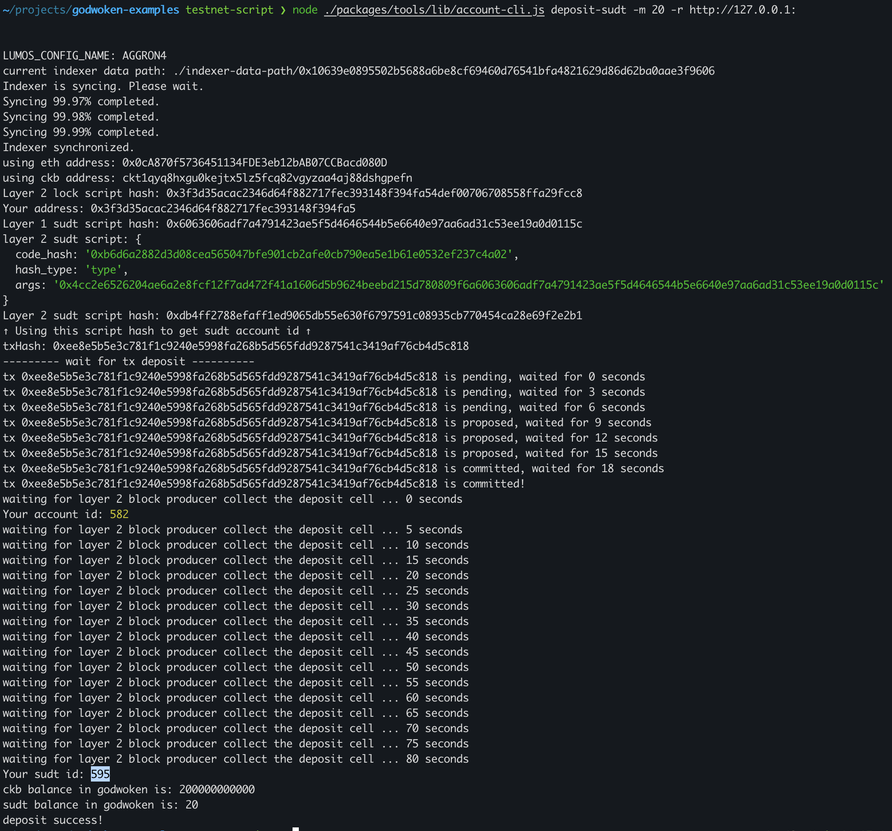

## 1. A link to the Layer 1 address you funded on the Testnet Explorer.
[https://explorer.nervos.org/aggron/address/ckt1qyq8hxgu0kejtx5lz5fcq82vgyzaa4aj88dshgpefn](https://explorer.nervos.org/aggron/address/ckt1qyq8hxgu0kejtx5lz5fcq82vgyzaa4aj88dshgpefn)
## 2. A screenshot of the console output immediately after using sudt-cli to create your SUDT tokens on Layer 1.

## 3. A link to the transaction ID created by sudt-cli on the Testnet Explorer.
[https://explorer.nervos.org/aggron/transaction/0x1f53e138a2ab0af9a63e5a43223a5602858393f8d4945a44fd1c53a63ab554ad](https://explorer.nervos.org/aggron/transaction/0x1f53e138a2ab0af9a63e5a43223a5602858393f8d4945a44fd1c53a63ab554ad)
## 4. A screenshot of the console output immediately after you have successfully submitted a deposit to Layer 2 using the account-cli tool.

## 5. The SUDT ID from the console output after executing the deposit script (in text format).
595