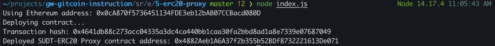
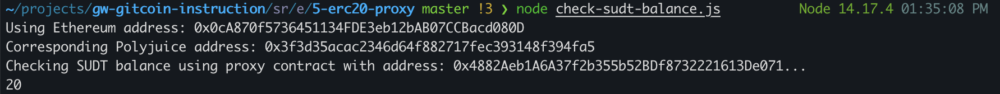

## 1. A screenshot of the console output immediately after deploying smart contract.

## 2. The address of the ERC20 Proxy Contract you deployed (in text format).
0x4882Aeb1A6A37f2b355b52BDf8732221613De071
## 3. A screenshot of the console output immediately after checking your SUDT balance.

## 4. The Ethereum address that was checked (in text format).
0x0cA870f5736451134FDE3eb12bAB07CCBacd080D