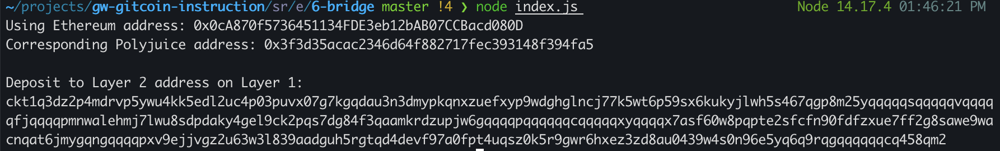

## 1. A screenshot of the console output immediately after you have successfully generated your Deposit Receiver Address.

## 2. Your Deposit Receiver Address (in text format).
ckt1q3dz2p4mdrvp5ywu4kk5edl2uc4p03puvx07g7kgqdau3n3dmypkqnxzuefxyp9wdghglncj77k5wt6p59sx6kukyjlwh5s467qgp8m25yqqqqqsqqqqqvqqqqqfjqqqqpmnwalehmj7lwu8sdpdaky4gel9ck2pqs7dg84f3qaamkrdzupjw6gqqqqpqqqqqqcqqqqqxyqqqqx7asf60w8pqpte2sfcfn90fdfzxue7ff2g8sawe9wacnqat6jmygqngqqqqpxv9ejjvgz2u63w3l839aadguh5rgtqd4devf97a0fpt4uqsz0k5r9gwr6hxez3zd8au0439w4s0n96e5yq6q9rqgqqqqqqcq458qm2
## 3. The Ethereum address used to generate the Deposit Receiver Address (in text format).
0x0cA870f5736451134FDE3eb12bAB07CCBacd080D
## 4. A link to the Etherscan explorer for the successful Force Bridge transaction. This can be found on Force Bridge under History→Succeed.
[https://rinkeby.etherscan.io/tx/0xa22dee12c056166a2af137a9575ed7c8e2eb7500e5c538f5221b1eb56084abfa](https://rinkeby.etherscan.io/tx/0xa22dee12c056166a2af137a9575ed7c8e2eb7500e5c538f5221b1eb56084abfa)
## 5. A link to the Nervos explorer for the successful Force bridge transaction. This can be found on Force Bridge under History→Succeed.
[https://explorer.nervos.org/aggron/transaction/0xb3c54e2b2faa505443fa8fbd4fc93a178e632a7815c648bad2ee7e82f8de79df](https://explorer.nervos.org/aggron/transaction/0xb3c54e2b2faa505443fa8fbd4fc93a178e632a7815c648bad2ee7e82f8de79df)