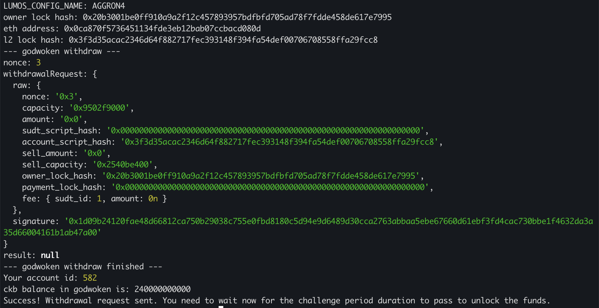

## 1. A screenshot of the console output immediately after running the withdraw command.

## 2. The Ethereum address that you've used for your Layer 2 account (in text format).
0x0cA870f5736451134FDE3eb12bAB07CCBacd080D
## 3. The Nervos Layer 1 address that you passed to withdraw command (in text format).
ckt1qyq8hxgu0kejtx5lz5fcq82vgyzaa4aj88dshgpefn
